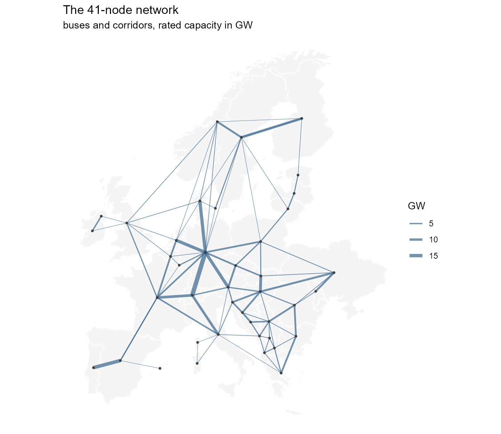
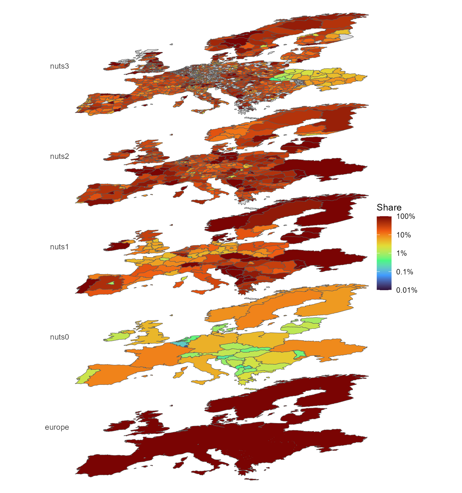

# The data sources

``` r

library(reneuro)
library(dplyr)
```

[`vignette("data")`](https://optimal2050.github.io/reneuro/articles/data.md)
walks through the *shipped* data — the models, the region hierarchy, and
how values aggregate. This article looks one step upstream: the sources
those objects are built from, what each one looks like, and what it
becomes in the shipped models. The heavy inputs (a 6.7 GB weather
cutout, a PyPSA-Eur clone) do not ship, so their figures are
pre-rendered by `data-raw/data_sources_figures.R` and committed;
everything drawn from shipped data is computed live on this page.

## 1. Weather: the cutout

Wind and solar availability come from one file: the *cutout*
`europe-2025-sarah3-era5.nc` — a 0.3° grid over Europe (177 × 131 cells)
with 8,760 hourly fields of wind speed, solar irradiance, temperature
and runoff for 2025. PyPSA-Eur turns it into per-region hourly capacity
factors; those arrive in the models as the `weather` objects
(`W_ONWIND`, `W_SOLAR`, …).


Mean 100 m wind speed over 2025, from the ERA5 fields of the cutout.


Mean solar influx (direct + diffuse) over 2025 — the SARAH-3 satellite
record with ERA5 infill at high latitudes.

Both sources are CC-BY: ERA5 from the Copernicus Climate Change Service,
SARAH-3 from EUMETSAT CM SAF. The exact notices ship in
`system.file("LICENSE.note", package = "reneuro")`.

## 2. Demand: measured ENTSO-E series

Hourly national load for 2025 comes from the ENTSO-E transparency
platform (with NESO for Great Britain). It lands in the models as each
region’s `demand`, distributed below country level by a GDP/population
proxy.


Weekly-mean measured demand for the eight largest systems. The workflow
fills the few countries with gaps (UA, MK, CY, AL) from template years.

The 2025 total across the modelled countries is 3,163 TWh — visible in
the shipped models as the sum over the demand objects:

``` r

objs <- pypsa_eur_41@data[[1]]@data
dem <- objs[vapply(objs, function(o) class(o)[1], "") == "demand"]
sum(vapply(dem, function(d) sum(d@demand$demand), 0)) / 1e6  # TWh
#> [1] 3162.754
```

## 3. The existing fleet

Power plants come from
[powerplantmatching](https://github.com/PyPSA/powerplantmatching), which
deduplicates GEM, JRC, ENTSO-E, GPD and other registries into one unit
list — 157,549 units with coordinates and capacities. In the models they
become the non-extendable `stock` (nuclear, coal, hydro, …) and the
`cap.lo` floors on extendable carriers (wind, solar); in the
`pypsa_eur_41_<year>` horizon series they also drive retirement, through
announced closure dates where they exist and assumed lifetimes
elsewhere.


Units of 100 MW and above, sized by capacity.

## 4. The network

Transmission comes from OpenStreetMap (which is what makes the shipped
data ODbL): substations and lines, simplified and clustered by
PyPSA-Eur. In the models it is the `trade` corridors. Drawn from shipped
data:

``` r

library(ggplot2)
gs <- pypsa_eur_41_gs
geo <- geoscales::geoscale_geometry(gs, "bus")
ctr <- suppressWarnings(sf::st_centroid(geo))
xy <- as.data.frame(sf::st_coordinates(ctr))
xy$bus <- geo$bus

tr <- objs[vapply(objs, function(o) class(o)[1], "") == "trade"]
routes <- unique(do.call(rbind, lapply(tr, function(t)
  cbind(t@routes[1, , drop = FALSE],
        MW = t@capacity$stock[1] %||% t@capacity$cap.lo[1]))))
seg <- routes |>
  left_join(xy, by = c(src = "bus")) |>
  rename(x0 = X, y0 = Y) |>
  left_join(xy, by = c(dst = "bus")) |>
  rename(x1 = X, y1 = Y)

ggplot() +
  geom_sf(data = geo, fill = "grey96", colour = "white", linewidth = 0.3) +
  geom_segment(data = seg, aes(x0, y0, xend = x1, yend = y1,
                               linewidth = MW / 1e3),
               colour = "steelblue4", alpha = 0.7) +
  geom_point(data = xy, aes(X, Y), size = 0.7, colour = "grey25") +
  scale_linewidth(range = c(0.2, 2.2)) +
  labs(title = "The 41-node network",
       subtitle = "buses and corridors, rated capacity in GW",
       linewidth = "GW") +
  theme_void() +
  theme(plot.background = element_rect(fill = "white", colour = NA))
```



## 5. Regional attributes

Population, GDP, demand shares and renewable potentials ride on
`nuts_gs`, computed by PyPSA-Eur on the NUTS3 polygons. The stack view
shows one of them across every level at once — here each region’s share
of the onshore wind potential within its parent, on the fixed log scale:

``` r

lt <- as.data.frame(geoscales::geoscale_leaftable(nuts_gs))
energyRt::plot_geoscale(nuts_gs, type = "stack", direction = "down",
                        view = "oblique",
                        data = lt[, c("nuts3", "pot_onwind")],
                        z = "pot_onwind", rule = "logshare")
#> Warning in ggplot2::scale_fill_viridis_c(option = palette, transform = "log10", : log-10 transformation introduced infinite values.
#> log-10 transformation introduced infinite values.
#> log-10 transformation introduced infinite values.
```



## 6. Sources at a glance

| source | licence | vintage | becomes |
|----|----|----|----|
| ERA5 (Copernicus C3S) | CC-BY | 2025 hourly | wind / hydro / temperature profiles → `weather` objects |
| SARAH-3 (EUMETSAT CM SAF) | CC-BY | 2025 hourly | solar profiles → `weather` objects |
| ENTSO-E transparency (+ NESO for GB) | open re-use | 2025 hourly | national load → `demand` |
| powerplantmatching | GPL-3 code, mixed open registries | through 2024 | fleet → `stock`, `cap.lo` floors, retirement in the horizon series |
| OpenStreetMap (+ TYNDP projects) | ODbL | 2026 extract | grid → `trade` corridors (the reason the data licence is ODbL) |
| NUTS / JRC / Eurostat layers | EU open licences | mixed | region geometry + attributes → `nuts_gs` |
| technology-data v0.14.0 | CC-BY | 2020–2050 in 5-year steps | costs → `invcost` / `varom` / supply prices |

What is *not* here: the World Database on Protected Areas
(non-redistributable; excluded, with the effect documented in
`LICENSE.note`) and the OPSD demand series (replaced by the 2025 ENTSO-E
pull).
