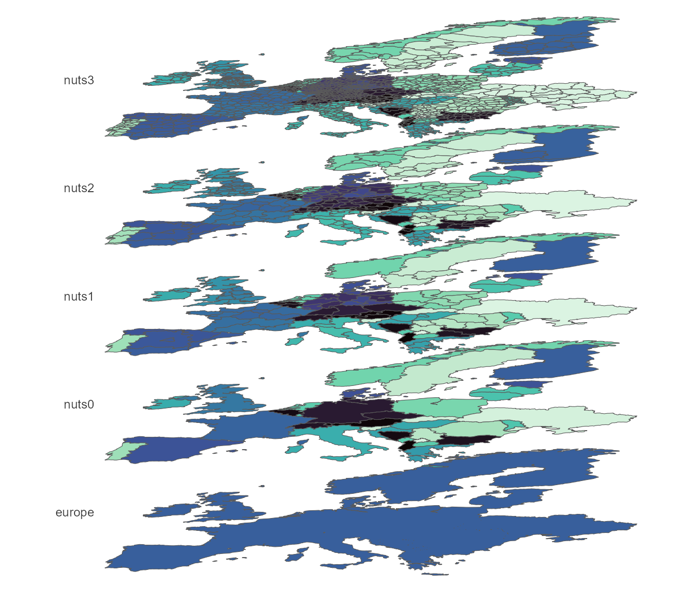
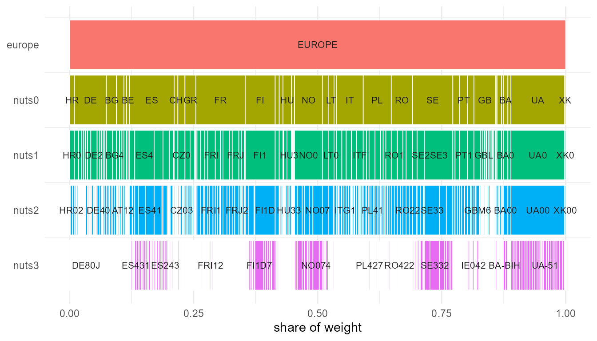
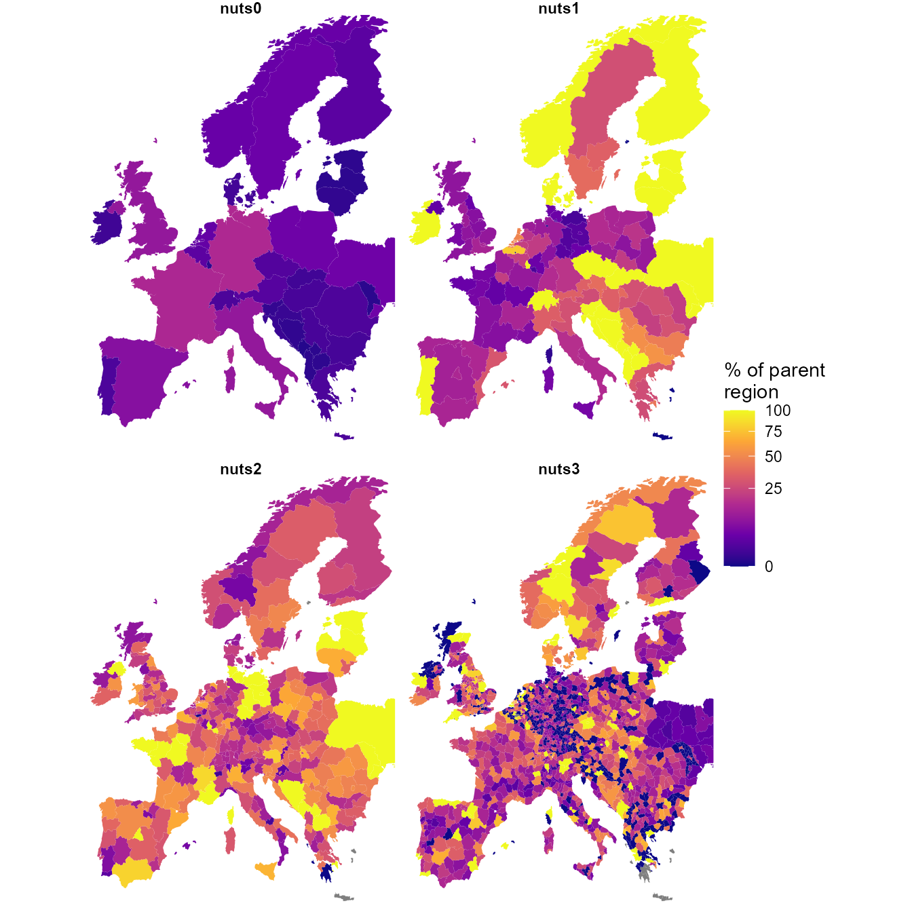
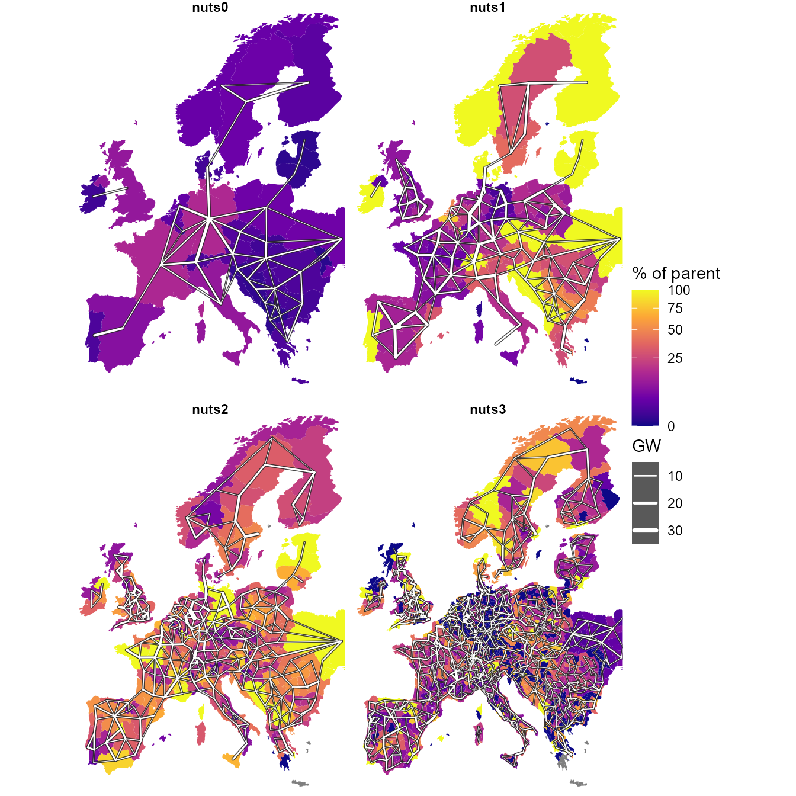

# The data

``` r

library(reneuro)
library(dplyr)
```

This article uses only shipped data. It needs no PyPSA-Eur clone and no
solver.

Three datasets describe the regions the models are built on: `nuts_gs`
(the geography and the data attached to it), `nuts_load` (demand) and
`nuts_lines` (transmission). Each section below aggregates one of them
from NUTS3 to coarser levels and gives the arithmetic used, which
differs by quantity: capacities sum, per-capita values take a weighted
mean, and peaks and impedances have to be recomputed rather than
combined.

## 1. Geography: five nested levels

``` r

gs <- nuts_gs
vapply(geoscales::geoscale_geoframes(gs),
       function(f) length(geoscales::geoscale_regions(gs, f)), 0L)
#> europe  nuts0  nuts1  nuts2  nuts3 
#>      1     36    109    296   1477
```

1,477 NUTS3 atoms group into 296 NUTS2, 109 NUTS1, 36 countries and a
single `europe` root. Every finer code has exactly one parent; the build
asserts this rather than assuming it, and the aggregation below depends
on it.

The `europe` root is the only region at which a continental commodity
balance can be declared. `newCommodity(geoframe = "europe")` gives one
Europe-wide CO2 allowance or gas market; without it the coarsest balance
is per country, i.e. 36 separate markets.

``` r

energyRt::plot_geoscale(gs, type = "stack")
```



The same hierarchy as an icicle plot:

``` r

energyRt::plot_geoscale(gs, type = "icicle") +
  ggplot2::labs(title = NULL)
```



Four countries — **BA, MD, UA, XK** — have no NUTS at all and are filled
from OpenStreetMap `adm1`. Those regions become the atoms, and the
levels above them are **padded** (`MD0`, `MD00`):

``` r

lt <- as.data.frame(geoscales::geoscale_leaftable(gs))

# Every aggregation below is "roll the atoms up to a coarser geoframe", which is
# a lookup from the NUTS3 code to its parent at that level. Named once here
# rather than rebuilt inline each time.
parent_of <- function(level, from = "nuts3") setNames(lt[[level]], lt[[from]])

lt |>
  filter(nuts0 %in% c("BA", "MD", "UA", "XK")) |>
  group_by(nuts0) |>
  summarise(atoms = n(), nuts1 = first(nuts1), nuts2 = first(nuts2))
#> # A tibble: 4 × 4
#>   nuts0 atoms nuts1 nuts2
#>   <chr> <int> <chr> <chr>
#> 1 BA        3 BA0   BA00 
#> 2 MD       37 MD0   MD00 
#> 3 UA       27 UA0   UA00 
#> 4 XK        7 XK0   XK00
```

PyPSA-Eur repeats the adm1 code at every level, which makes each such
region its own parent. The derived hierarchy then contains pairs like
`(MD-BA, MD-BA)`, and energyRt’s spatial roll-up becomes
`vOutTot[MD-BA] = ... + vOutTot[MD-BA]`, forcing every other term to
zero without error.

Eurostat’s convention for identical geography is a distinct code per
level: Luxembourg is `LU → LU0 → LU00 → LU000`, and no NUTS country
produces an identity pair. The padding here follows that convention.
“NUTS1” and “NUTS2” for these four countries remain stand-ins rather
than real administrative levels.

``` r

f <- geoscales::geoscale_geoframes(gs)
vapply(seq_len(length(f) - 1L),
       function(i) isTRUE(geoscales::geoscale_nests(gs, f[i], f[i + 1L])),
       logical(1))
#> [1] TRUE TRUE TRUE TRUE
```

Every adjacent pair nests. Where nesting fails, a region has two parents
and its balance is added into both.

## 2. What each region carries

The leaftable holds 14 data columns per region, in two families. The
family determines what a column can be used for.

``` r

setdiff(names(lt), c("region", geoscales::geoscale_geoframes(gs)))
#>  [1] "km2"               "pop"               "gdp"              
#>  [4] "gdp_total"         "load_twh"          "peak_mw"          
#>  [7] "n_buses"           "cap_mw"            "hydro_mw"         
#> [10] "pot_onwind"        "pot_solar"         "pot_solar_hsat"   
#> [13] "pot_offwind_ac"    "pot_offwind_dc"    "pot_offwind_float"
```

**Geographic**, read from the region shapes and defined for all 1,477
atoms:

| column      | unit                       | kind          |
|-------------|----------------------------|---------------|
| `km2`       | km², equal-area projection | extensive     |
| `pop`       | thousands                  | extensive     |
| `gdp`       | EUR per capita             | **intensive** |
| `gdp_total` | thousand EUR               | extensive     |

**Model**, read from the NUTS3 network and located at substation buses:

| column | unit | kind |
|----|----|----|
| `load_twh` | TWh per year | extensive |
| `peak_mw` | MW, coincident | **neither** |
| `n_buses` | substations in the region | extensive |
| `cap_mw`, `hydro_mw` | MW built today | extensive |
| `pot_onwind`, `pot_solar`, `pot_solar_hsat` | MW of potential | extensive |
| `pot_offwind_ac`, `pot_offwind_dc`, `pot_offwind_float` | MW of potential | extensive |

### Weights

``` r

geoscales::geoscale_weights(gs)
#> [1] "km2"        "pop"        "gdp_total"  "load_twh"   "cap_mw"    
#> [6] "pot_onwind" "pot_solar"
```

A weight splits a coarse quantity across atoms and averages an intensive
one back up. Seven columns are declared as weights, and the choice
changes the result. German demand split by area differs from the same
demand split by population or by measured demand:

``` r

de <- filter(lt, nuts0 == "DE")

vapply(c("km2", "pop", "load_twh", "pot_onwind"),
       function(w) round(max(de[[w]]) / sum(de[[w]]), 4), 0)
#>        km2        pop   load_twh pot_onwind 
#>     0.0154     0.0440     0.0312     0.0165
```

The largest German region takes 1.5% of the country by area and 4.4% by
population. No check rejects an unsuitable weight, so the choice is the
caller’s to make.

### `gdp` is intensive

``` r

lt |>
  group_by(nuts0) |>
  summarise(plain_sum = round(sum(gdp)),
            pop_weighted_mean = round(sum(gdp * pop) / sum(pop)),
            gdp_total_bn = round(sum(gdp_total) * 1e3 / 1e9)) |>
  arrange(desc(gdp_total_bn)) |>
  head(5)
#> # A tibble: 5 × 4
#>   nuts0 plain_sum pop_weighted_mean gdp_total_bn
#>   <chr>     <dbl>             <dbl>        <dbl>
#> 1 DE     15618746             41813         3475
#> 2 GB      6887044             37577         2505
#> 3 FR      2963348             36685         2391
#> 4 IT      2929600             30056         1795
#> 5 ES      1239705             26641         1193
```

Summing `gdp` over Germany gives 15.6 million, which is not a quantity.
The population-weighted mean, ~41,800 EUR, is its GDP per capita.
`gdp_total` is shipped to provide an extensive money weight and gives
~3,475 bn EUR.

### The renewable potentials overlap

``` r

lt |>
  group_by(nuts0) |>
  summarise(across(c(pot_onwind, pot_solar, pot_solar_hsat,
                     pot_offwind_ac, pot_offwind_dc, pot_offwind_float),
                   \(x) round(sum(x) / 1e3))) |>
  arrange(desc(pot_onwind)) |>
  head(5)
#> # A tibble: 5 × 7
#>   nuts0 pot_onwind pot_solar pot_solar_hsat pot_offwind_ac pot_offwind_dc
#>   <chr>      <dbl>     <dbl>          <dbl>          <dbl>          <dbl>
#> 1 FR           969      1683           1462             30              7
#> 2 SE           942       234            203             64             22
#> 3 ES           938      1095            951             13              0
#> 4 UA           851      3046           2646             62             32
#> 5 NO           790       302            263             45             15
#> # ℹ 1 more variable: pot_offwind_float <dbl>
```

These columns must not be summed. `pot_solar` and `pot_solar_hsat` are
fixed-tilt and single-axis-tracking photovoltaics on the same land, and
313 of the 314 offshore regions carry more than one `pot_offwind_*` type
over the same sea area. They ship as separate columns so no summing rule
is imposed. The three offshore columns are excluded from the weight set
because they are zero for every landlocked country.

### Where the model data is zero

``` r

lt |>
  summarise(regions = n(),
            no_substation = sum(n_buses == 0),
            pct = round(100 * mean(n_buses == 0), 1))
#>   regions no_substation  pct
#> 1    1477           442 29.9
```

PyPSA-Eur places demand, plant and potential at substation buses, and
442 NUTS3 regions contain none. Every model column is zero there; the
geographic columns are unaffected. The zero reflects the model’s
allocation, in which a busless region’s land and load were folded into
the neighbour it clusters with, rather than the region itself.

The same applies at coarser levels:

``` r

bind_rows(lapply(c("nuts2", "nuts1", "nuts0"), function(l) {
  lt |>
    group_by(group = .data[[l]]) |>
    summarise(buses = sum(n_buses), .groups = "drop") |>
    summarise(level = l, groups = n(), no_substation = sum(buses == 0))
}))
#> # A tibble: 3 × 3
#>   level groups no_substation
#>   <chr>  <int>         <int>
#> 1 nuts2    296             7
#> 2 nuts1    109             3
#> 3 nuts0     36             0
```

Seven NUTS2 groups and three NUTS1 groups contain no substation. These
are the regions lost when 296 NUTS2 regions become 289 model nodes and
109 NUTS1 become 106. A weight summing to zero over a group divides by
zero when averaging into it; the affected groups are recorded on the
object rather than substituted:

``` r

names(attr(gs, "weight_degeneracy"))
#> [1] "load_twh"   "cap_mw"     "pot_onwind" "pot_solar"
```

Two entries are degenerate for a different reason. `GBI3` (Inner London)
has no generation and no land the availability rules admit for wind;
`NO07` (Nord-Norge) has no solar potential, lying above the Arctic
Circle.

## 3. Load

``` r

head(nuts_load, 3)
#>    level region    load_twh  peak_gw n_buses
#> 1 europe EUROPE 3356.475513 543.3607    4356
#> 2  nuts0     AL    7.605935   1.6590      13
#> 3  nuts0     AT   69.470957  11.4410      66
```

### Energy is extensive

Going from 1,477 regions to 36 requires only a sum:

Show code

``` r

fine <- filter(nuts_load, level == "nuts3")

agg_load <- function(col) {
  fine |>
    mutate(region = parent_of(col)[region]) |>
    group_by(region) |>
    summarise(load_twh = sum(load_twh), .groups = "drop") |>
    mutate(level = col)
}
derived <- bind_rows(lapply(c("nuts0", "nuts1", "nuts2"), agg_load))

# ...and it must agree with what was computed independently at each level.
nuts_load |>
  filter(level %in% c("nuts0", "nuts1", "nuts2")) |>
  select(level, region, load_twh) |>
  inner_join(derived, by = c("level", "region"),
             suffix = c("_shipped", "_derived")) |>
  group_by(level) |>
  summarise(regions = n(),
            max_abs_diff = max(abs(load_twh_derived - load_twh_shipped)))
```

    #> # A tibble: 3 × 3
    #>   level regions max_abs_diff
    #>   <chr>   <int>        <dbl>
    #> 1 nuts0      36     1.42e-14
    #> 2 nuts1     109     7.11e-15
    #> 3 nuts2     296     7.11e-15

The difference is zero at every level: the parts add to the whole, and
no weight is involved.

### Peak is not extensive

Show code

``` r

pk <- function(fine_lv, coarse_lv) {
  f <- filter(nuts_load, level == fine_lv)
  m <- parent_of(coarse_lv, from = fine_lv)
  tibble(level = coarse_lv,
         summed = sum(tapply(f$peak_gw, m[f$region], sum)),
         coincident = sum(nuts_load$peak_gw[nuts_load$level == coarse_lv]))
}

bind_rows(
  pk("nuts3", "nuts2"), pk("nuts2", "nuts1"), pk("nuts1", "nuts0"),
  tibble(level = "europe",
         summed = sum(nuts_load$peak_gw[nuts_load$level == "nuts0"]),
         coincident = nuts_load$peak_gw[nuts_load$level == "europe"])) |>
  mutate(overstated_pct = round(100 * (summed / coincident - 1), 2))
```

    #> # A tibble: 4 × 4
    #>   level  summed coincident overstated_pct
    #>   <chr>   <dbl>      <dbl>          <dbl>
    #> 1 nuts2    580.       580.           0   
    #> 2 nuts1    580.       580.           0   
    #> 3 nuts0    580.       580.           0   
    #> 4 europe   580.       543.           6.81

In general `peak(parent) <= sum(peak(children))`, the gap being load
diversity. Here the gap is zero within every country and appears only
across Europe, at 6.8% (580 GW summed against 543 GW coincident).

This follows from the data rather than from European demand. PyPSA-Eur
builds per-bus load as a static fraction times the national hourly
series, so every bus in a country has the same normalised shape and
their peaks coincide. Diversity appears only where the shapes differ,
which is between countries.

Resolution finer than a country therefore adds spatial detail to the
level of demand but not to its shape: at NUTS3, 1,477 regions share 36
distinct profiles.

### 442 regions carry no demand

``` r

nuts_load |>
  filter(level == "nuts3") |>
  summarise(regions = n(),
            no_demand = sum(n_buses == 0),
            pct = round(100 * mean(n_buses == 0), 1))
#>   regions no_demand  pct
#> 1    1477       442 29.9
```

`load.substation_only: true` places demand only on substation buses, and
442 NUTS3 regions contain none; Germany alone has 182. They ship as
explicit zeros rather than missing rows. A NUTS3 model therefore has
demand in 70% of its regions, which bounds the resolution that is
useful.

### The maps

Each region is shaded by its share of its parent’s demand: a country
against Europe, a NUTS3 district against the NUTS2 region containing it.
Shares of the European total would instead restate the size of each
region, which does not change with resolution.

Show the map helpers

``` r

library(ggplot2)

# geoscale_geometry() dissolves the atoms up to the requested geoframe and
# returns an sf keyed by it, already carrying the CRS -- so the only work left
# is to give that key column the common name the joins below use.
level_sf <- function(lv) {
  geoscales::geoscale_geometry(nuts_gs, geoframe = lv) |>
    rename_with(\(nm) ifelse(nm == lv, "region", nm))
}

# The geoframes are ordered coarse -> fine, so a level's parent is the one
# before it: nuts3 -> nuts2, and nuts0 -> the single `europe` root.
GF <- geoscales::geoscale_geoframes(nuts_gs)
parent_frame <- function(lv) GF[[which(GF == lv) - 1L]]

load_map <- function(lv) {
  shares <- nuts_load |>
    filter(level == lv) |>
    select(region, load_twh) |>
    left_join(distinct(lt, region = .data[[lv]],
                       parent = .data[[parent_frame(lv)]]), by = "region") |>
    group_by(parent) |>
    # A parent carrying no demand at all divides by zero -- those are the
    # busless groups counted above. They map as missing, not as 0/0.
    mutate(total = sum(load_twh),
           share = if_else(total > 0, 100 * load_twh / total, NA_real_)) |>
    ungroup()

  level_sf(lv) |>
    left_join(select(shares, region, load_twh, share), by = "region")
}
BOX <- list(xlim = c(-11, 32), ylim = c(34, 71))   # crop overseas territories
```

Show code

``` r

# rbind.sf, not bind_rows: the data-frame route drops the CRS and coord_sf()
# then fails inside the projection step.
LEVELS <- c("nuts0", "nuts1", "nuts2", "nuts3")

maps <- do.call(rbind, lapply(LEVELS, function(l) {
  s <- load_map(l); s$level <- l; s
}))
maps$level <- factor(maps$level, levels = LEVELS)

ggplot(maps) +
  geom_sf(aes(fill = share), colour = NA) +
  facet_wrap(~level, ncol = 2) +
  scale_fill_viridis_c(option = "C", trans = "sqrt",
                       name = "% of parent\nregion") +
  coord_sf(xlim = BOX$xlim, ylim = BOX$ylim, expand = FALSE) +
  theme_void() +
  theme(strip.text = element_text(face = "bold"))
```



At NUTS0 each country’s share of Europe is at most 15%. At NUTS3 the
shares spread across the full range: most districts carry a small part
of their NUTS2 region and a few carry nearly all of it. The dark patches
are the 442 regions with no substation, which carry none. Grey regions
are those whose parent has no demand at all — the seven NUTS2 groups
counted above.

## 4. Transmission

`nuts_lines` holds every `base_s` line whose ends fall in different
NUTS3 regions. The rest were dropped:

``` r

p <- attr(nuts_lines, "reneuro_provenance")
c(lines_total = p$lines_total, intra_nuts3_dropped = p$lines_intra_dropped,
  shipped = nrow(nuts_lines))
#>         lines_total intra_nuts3_dropped             shipped 
#>                7360                4218                3142
```

57% of lines never leave a NUTS3 region, and they carry 53% of the
network’s capacity. The finest level available discards more than half
the grid.

### Aggregating a corridor

Show the aggregation code

``` r

centroids <- function(level) {
  s <- level_sf(level)
  cc <- suppressWarnings(sf::st_coordinates(sf::st_centroid(sf::st_geometry(s))))
  tibble(region = s$region, cx = cc[, 1], cy = cc[, 2])
}

haversine <- function(x1, y1, x2, y2) {
  R <- 6371; r <- pi / 180
  a <- sin((y2 - y1) * r / 2)^2 +
       cos(y1 * r) * cos(y2 * r) * sin((x2 - x1) * r / 2)^2
  2 * R * asin(pmin(1, sqrt(a)))
}

agg_lines <- function(level, length_factor = 1.25) {
  m  <- parent_of(level)
  ct <- centroids(level)
  nuts_lines |>
    mutate(f = m[from], t = m[to]) |>
    filter(f != t) |>
    # canonical order, so A-B and B-A are one corridor
    mutate(a = pmin(f, t), b = pmax(f, t)) |>
    left_join(rename(ct, a = region, cx0 = cx, cy0 = cy), by = "a") |>
    left_join(rename(ct, b = region, cx1 = cx, cy1 = cy), by = "b") |>
    mutate(new_len = haversine(cx0, cy0, cx1, cy1) * length_factor,
           lf = if_else(length_km > 0, new_len / length_km, new_len)) |>
    group_by(from = a, to = b) |>
    summarise(s_nom = sum(s_nom), n_lines = n(),
              length_km = first(new_len),
              x = 1 / sum(1 / (lf * x)),        # parallel, length-rescaled
              cx0 = first(cx0), cy0 = first(cy0),
              cx1 = first(cx1), cy1 = first(cy1),
              .groups = "drop")
}
```

Three rules, taken from `pypsa.clustering.spatial`:

- `s_nom` **sums** — thermal ratings of parallel circuits add;
- `length` is **recomputed** as the great-circle distance between the
  two region centroids times `line_length_factor` (1.25) — it is *not*
  inherited;
- `x` is rescaled by the length ratio, then **parallel-combined** as
  `1 / Σ(1/x)`.

``` r

bind_rows(lapply(LEVELS, function(l) {
  a <- agg_lines(l)
  tibble(level = l, corridors = nrow(a),
         GW = round(sum(a$s_nom) / 1e3),
         median_km = round(median(a$length_km)),
         median_x = round(median(a$x), 2))
}))
#> # A tibble: 4 × 5
#>   level corridors    GW median_km median_x
#>   <chr>     <int> <dbl>     <dbl>    <dbl>
#> 1 nuts0        65   356       459     28.8
#> 2 nuts1       203  1357       253     16.0
#> 3 nuts2       547  2518       154     13.2
#> 4 nuts3      1789  5004        85     11.2
```

> Checked against PyPSA-Eur’s own 41-cluster network, built by its
> `cluster_network` rule: the capacity crossing a country boundary sums
> to 356,352.715 MW there and 356,352.715 MW in the table above. The
> corridor counts differ (77 against 65) because 41 clusters is not 36
> countries. The comparison requires a clone and so is recorded here
> rather than run.

Note the length column. Aggregating to countries lengthens the network
rather than shortening it: a corridor becomes the distance between two
national centroids, which for DE–FR spans most of both countries.
Impedance follows length, so `r` rises with it, and since
`loss ∝ r · s_nom²`, losses are overestimated at coarse levels.

Capacity is overestimated for a separate reason: summing thermal ratings
ignores N-1 security and the loop flows that consume real boundary
capacity. PyPSA-Eur compensates with a flat `s_max_pu = 0.7`, applied
identically at 4,382 nodes and at 41.

The two errors act in opposite directions and do not cancel.

### The network as the model sees it

Straight chords between region centroids, which is what the aggregated
model contains:

Show code

``` r

nets <- bind_rows(lapply(LEVELS, function(l) mutate(agg_lines(l), level = l)))
nets$level <- factor(nets$level, levels = LEVELS)

# white lines alone drown on plasma's bright end -- case them in dark grey
nets$lw <- scales::rescale(nets$s_nom / 1e3, to = c(0.1, 1.4))

ggplot() +
  geom_sf(data = maps, aes(fill = share), colour = NA) +
  geom_segment(data = nets,
               aes(x = cx0, y = cy0, xend = cx1, yend = cy1,
                   linewidth = I(lw + 0.5)),
               colour = "grey15", alpha = 0.85, lineend = "round") +
  geom_segment(data = nets,
               aes(x = cx0, y = cy0, xend = cx1, yend = cy1,
                   linewidth = s_nom / 1e3),
               colour = "white", lineend = "round") +
  facet_wrap(~level, ncol = 2) +
  scale_fill_viridis_c(option = "C", trans = "sqrt", name = "% of parent") +
  scale_linewidth_continuous(range = c(0.1, 1.4), name = "GW") +
  coord_sf(xlim = BOX$xlim, ylim = BOX$ylim, expand = FALSE) +
  theme_void() +
  theme(strip.text = element_text(face = "bold"),
        legend.key = element_rect(fill = "grey35", colour = NA))
```



At NUTS0 the mesh is reduced to 36 nodes and a small number of long
chords. At NUTS3 the structure of the European grid is recognisable,
though half of it has already been absorbed into the nodes.

## 5. Every quantity and its arithmetic

| quantity | kind | fine → coarse | coarse → fine |
|----|----|----|----|
| `km2`, `pop`, `gdp_total` | extensive | `sum` | split by weight |
| `load_twh`, `cap_mw`, `hydro_mw` | extensive | `sum` | split by weight |
| `pot_*` | extensive | `sum` **within a carrier** | split by weight |
| `n_buses` | extensive | `sum` | **cannot** be split |
| `gdp` (per capita) | intensive | `weighted_mean` by `pop` | copy |
| `peak_mw` | neither | **cannot** be derived — recompute from hourly | — |
| `s_nom` | extensive | `sum`, intra-region dropped | — |
| `length` | geometric | **recomputed** from centroids × 1.25 | — |
| `x`, `r` | reciprocal | rescale by length, then `1/Σ(1/x)` | — |
| load *shape* | — | already national; finer adds nothing | — |

The kind determines the reduction. Applying the wrong one produces no
error: a sum of per-capita GDP, of peaks, or across two overlapping
potentials returns a plausible number that does not correspond to any
quantity.

## See also

- [`vignette("reneuro")`](https://optimal2050.github.io/reneuro/r/articles/reneuro.md)
  — a model end to end, and restricting one to a region subset
- [`vignette("about")`](https://optimal2050.github.io/reneuro/r/articles/about.md)
  — how each model was built, solver benchmarks, references
- [`?nuts_gs`](https://optimal2050.github.io/reneuro/r/reference/nuts_gs.md),
  [`?nuts_load`](https://optimal2050.github.io/reneuro/r/reference/nuts_load.md),
  [`?nuts_lines`](https://optimal2050.github.io/reneuro/r/reference/nuts_lines.md)
